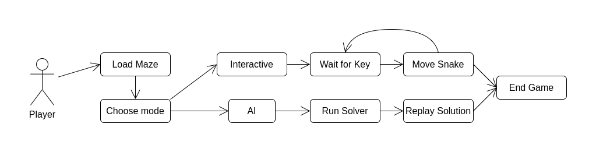
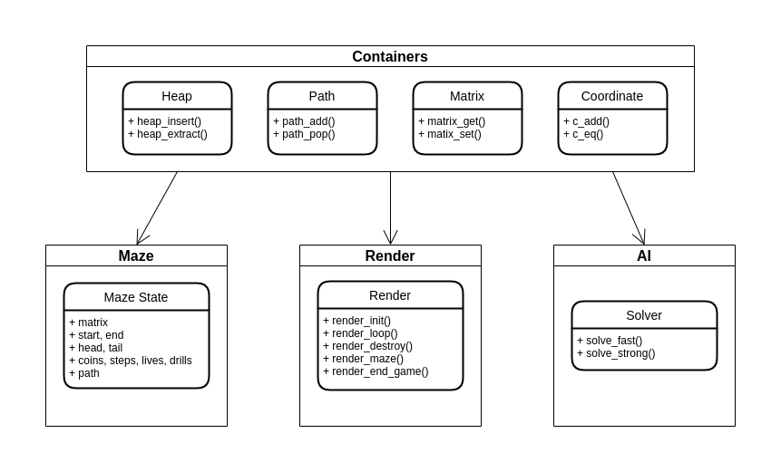

**RELAZIONE SNAKE LABYRINTH**

**COMPOSIZIONE GRUPPO E PRINCIPALI DIFFICOLTÀ**

Il nostro gruppo si compone di due membri dotati di conoscenze pregresse differenti in ambito informatico.

Leone Bacciu (matricola: 894862) possiede una particolare esperienza nella materia, avendo già frequentato un ITIS informatico, e
avendo più volte partecipato alle Olimpiadi di Informatica.

Marco Diotto (matricola: 895937) proviene da un percorso di studi completamente differente e non possedeva alcuna conoscenza
informatica prima dell’inizio del corso.

Proprio a causa dell'eterogeneità del gruppo le principali difficoltà incontrate riguardano l’implementazione e la
comprensione chiara di funzioni e strutture dati talvolta complesse e di conseguenza una distribuzione del lavoro non
paritaria.

Tuttavia il superamento di tali difficoltà si è dimostrato fruttuoso per entrambi, in quanto Diotto è riuscito a venire
a contatto con concetti avanzati e a comprendere come lavorare e soprattutto collaborare attivamente ad un progetto
informatico mentre Bacciu ha espanso la conoscenza del linguaggio C (in particolare rispetto a NCurses e CMake) ed è
riuscito a migliorare la sua capacità di scrivere codice, rendendolo più chiaro e fruibile anche per un principiante.

**STRUTTURA DEL PROGETTO**

Il codice si compone di quattro parti principali:

* **CONTAINERS** : contengono le principali strutture dati implementate e le relative funzioni:
    1. **Heap (Max Heap):** un albero binario bilanciato, in cui ad ogni nodo padre (coppia chiave-valore) è associata
       una chiave maggiore rispetto a quella dei suoi nodi figli, utilizzata in questo caso per implementare una coda di
       priorità.
    2. **Path:** una linked list ottimizzata, che utilizza una semplice forma di reference counting per liberare la
       memoria inutilizzata.
    3. **Matrix:** una matrice flattened, in cui ad ogni posizione è associato un valore intero. Utilizzata per
       rappresentare la mappa del labirinto.
    4. **Coordinate:** semplice struttura dati che tramite una coppia di interi (x, y) rappresenta le coordinate di un
       determinato elemento.
* **MAZE:** contiene una struttura dati volta a rappresentare lo stato del gioco in un determinato momento della partita
  e le principali funzioni per operare sul labirinto.
* **RENDER:** gestisce la visualizzazione dello stato della partita e controlla la grafica del terminale per mezzo di
  NCurses.
* **AI:** contiene i tre algoritmi risolutivi sviluppati:
    1. **AI Fast (Bacciu):** è una soluzione iterativa, che implementa un algoritmo greedy simile all’algoritmo
       di [Dijkstra](https://en.wikipedia.org/wiki/Dijkstra%27s_algorithm) per il percorso più breve, modificato per il
       problema specifico. Il labirinto viene interpretato come un grafo direzionato pesato, dove i pesi dei vertici
       sono il punteggio che si ottiene entrando in una cella (-1 se la cella è vuota, 10-1 se la cella contiene una
       moneta, etc…). La principale difficoltà consiste nel fatto che il grafo è dinamico, infatti, quando si passa per
       una cella, qualunque oggetto fosse presente viene rimosso, e vengono quindi modificati i relativi pesi entranti (
       inoltre, nel caso del dimezzamento i pesi dipendono dalla lunghezza del serpente in quel momento). Per risolvere
       questi problemi l’algoritmo non si arresta quando trova il primo percorso che raggiunge la fine, ma quando trova
       il percorso che passa per tutti i bonus e converge più velocemente, oppure quando la coda di priorità dei nodi si
       svuota. Questa strategia migliora molto la precisione dell’algoritmo, ma lo rende estremamente lento. È stata
       quindi implementata una strategia di pesante ottimizzazione: vengono esclusi tutte le celle candidate a essere la
       successiva, se esiste già almeno un altro percorso con un punteggio più alto, una strada più breve e un maggior
       numero di trivelle che passa per quella cella. Essendo questo algoritmo un'euristica, visitare le celle in ordine
       diverso porterà a risultati diversi, per questo, nel tentativo di migliorare ulteriormente la precisione,
       l'algoritmo viene eseguito qualche centinaio di volte, visitando, ad ogni step, le celle successive in un ordine
       casuale.
    2. **AI Strong (Diotto):** è una soluzione ricorsiva che implementa
       l’algoritmo [Depth-First Search](https://en.wikipedia.org/wiki/Depth-first_search) (DFS), il quale ricerca tutti
       i possibili percorsi fino ad una determinata profondità, per evidenziare infine quello migliore. La ricorsione è
       stata tuttavia ottimizzata e non ripercorre strade già battute nel caso in cui il punteggio associato ad una
       determinata posizione del labirinto sia inferiore a quello già ottenuto precedentemente nella stessa posizione e
       lungo lo stesso percorso, in tal modo si evita di incorrere in loop e la funzione risulta meno dispendiosa in
       termini di memoria. \
       Il percorso trovato dalla soluzione ricorsiva è indubbiamente il migliore, tuttavia essa è utilizzabile solamente
       in labirinti piuttosto piccoli e con una profondità limitata, in quanto l’aumento di quest’ultima porta i
       possibili percorsi ad un numero esponenziale con conseguente sfruttamento di memoria che rende la funzione
       talvolta impossibile da utilizzare.
    3. **AI Experimental (Bacciu):** è una soluzione estremamente poco rifinita, che implementa un algoritmo di
       Reinforcement Learning, nello specifico [Q-Learning](https://en.m.wikipedia.org/wiki/Q-learning). L’algoritmo
       esegue moltissime simulazioni (episodi) dove ad ogni step decide casualmente se scegliere una direzione
       arbitraria o utilizzare le informazioni sul punteggio ottenibile in quella direzione, ottenute negli episodi
       precedenti. Queste informazioni vengono salvate in una tabella dove vengono aggiornate ad ogni step. Dopo molti
       episodi le informazioni della tabella vengono estratte e viene costruito un percorso. L’implementazione di questa
       strategia non è ottimale, perché come stato della partita viene utilizzata soltanto la
       coppia [posizione corrente, numero di visite alla cella corrente], che è sufficientemente significativa da
       portare snake alla fine del labirinto, ma non è ottimale perché si perdono informazioni circa le celle visitate e
       la lunghezza di snake.

**STRUTTURA FILE ED ESECUZIONE**

Abbiamo deciso di suddividere le funzioni e le strutture dati in file .h (header) e .c in modo da rendere il progetto
più fruibile e chiaro riguardo l’uso di ogni componente, evitando anche dipendenze circolari e doppie definizioni.

Per compilare i file abbiamo utilizzato il software di automazione dello sviluppo CMake che permette di collegare le
librerie, anche in piattaforme diverse (Windows-UNIX), e compilare tutti i file del progetto.

Una volta compilato il progetto può essere eseguito in modi diversi, specificando con una flag quale tipo di AI
utilizzare, o se avviare il programma in modalità interattiva. Il labirinto viene caricato da standard input o da un
file di testo se specificato.

**DIVISIONE DEL CARICO DI LAVORO**

Bacciu ha creato le strutture dati principali e ha contribuito nella scrittura del codice, anche aiutando Diotto,
specialmente nella comprensione di concetti sconosciuti o complessi. L’intelligenza artificiale iterativa è stata
implementata da Bacciu ed è stata utilizzata per tutte le challenge del progetto, mentre la soluzione ricorsiva è stata
implementata da Diotto dopo un attento studio combinato.

**CONCLUSIONE**

Siamo molto soddisfatti dell’esito del progetto e al netto delle difficoltà riteniamo quest’attività particolarmente
formativa e utile per venire a contatto con concetti nuovi e complessi, nonché per migliorare le nostre competenze di
team working.
